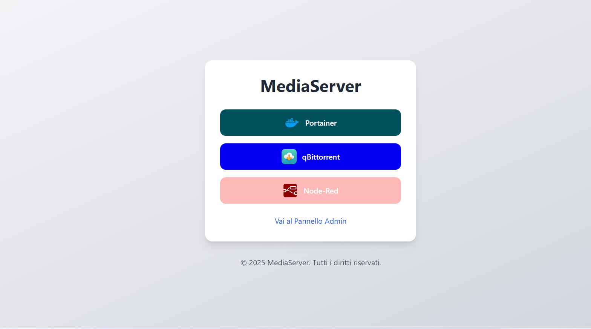

# SelfHostLinks

A simple, self-hosted link aggregation page.  
Easily create and manage your own list of links with a clean interface.



---

## 🚀 Features

- Responsive UI powered by TailwindCSS
- Admin panel with login (one user only)
- Custom link title, URL, color, and icon upload
- SQLite database (lightweight and portable)
- Persistent configuration using `.env` file
- Docker-ready deployment with `deploy.sh`
- Rate limiting on login with Flask-Limiter
- Passwords hashed using `scrypt` (via Werkzeug)

---

## ⚙️ Quick Setup (Docker)

```bash
# 1. Clone the repository
git clone https://github.com/yourusername/SelfHostLinks.git
cd SelfHostLinks

# 2. Create your own .env from example
cp .env.example .env
# Edit .env and fill in your values

# 3. Start the app
chmod +x deploy.sh
./deploy.sh
```

Then go to `http://localhost` (or your server IP) to access your site.

---

## 🔐 .env Configuration

```env
APP_NAME=your_app_name_here
SECRET_KEY=your_secret_key_here
ADMIN_USERNAME=your_admin_username
ADMIN_PASSWORD_HASH=your_password_hash_here
```

📌 **Note:** escape `$` with `$$` in the password hash if using `.env` with Docker Compose!

---

## 🔐 Generate password hash

You can generate a secure scrypt hash using this Python snippet:

```python
from werkzeug.security import generate_password_hash
print(generate_password_hash("your_password", method="scrypt"))
```

Then update `.env` with:

```env
ADMIN_PASSWORD_HASH=scrypt:...   # escape $ as $$
```

---

## 📦 Technologies Used

- [Flask](https://flask.palletsprojects.com/)
- [SQLite](https://www.sqlite.org/index.html)
- [TailwindCSS](https://tailwindcss.com/)
- [Docker](https://www.docker.com/)
- [Flask-Limiter](https://flask-limiter.readthedocs.io/)
- [Werkzeug](https://werkzeug.palletsprojects.com/)

---

## 📜 License

MIT © 2025 - Peppinosh
